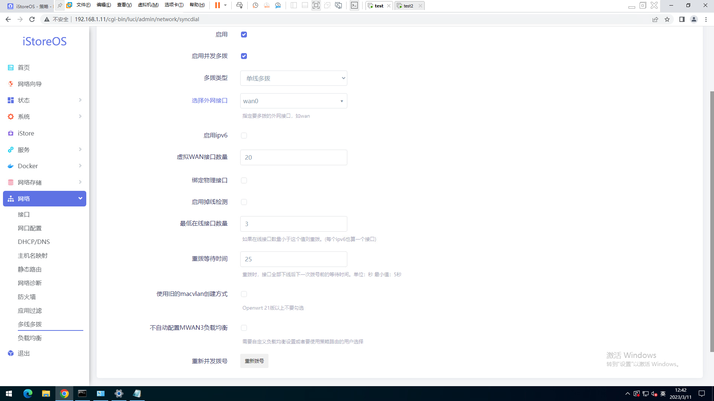
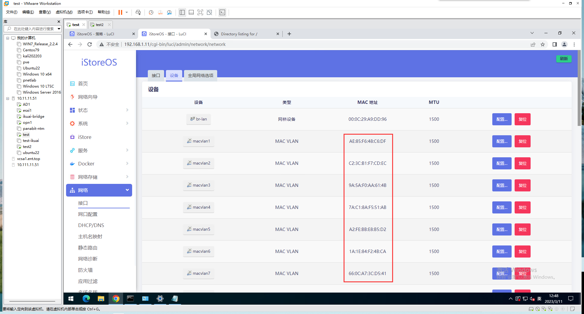
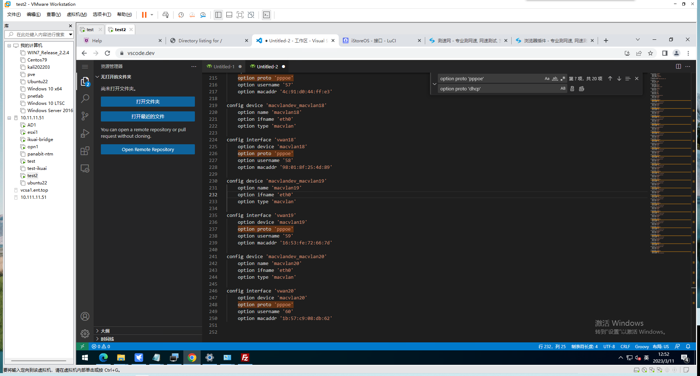
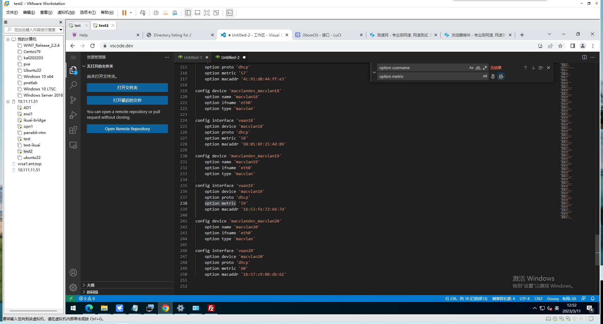
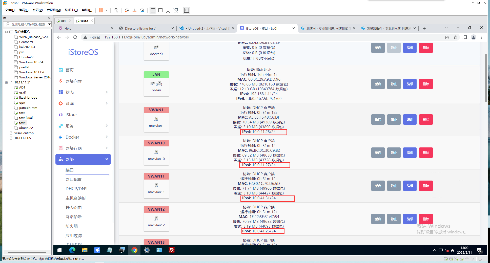
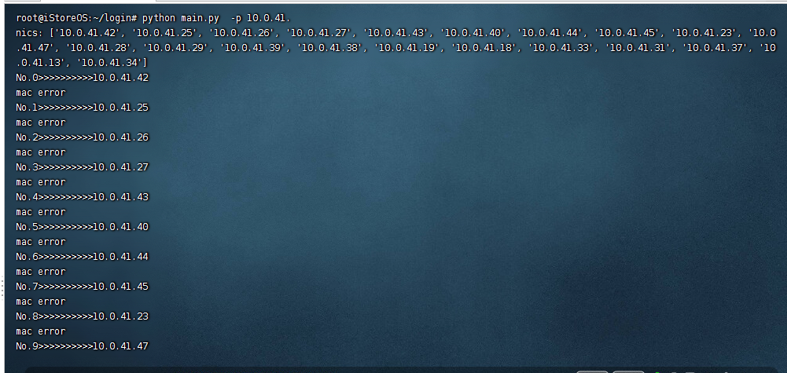
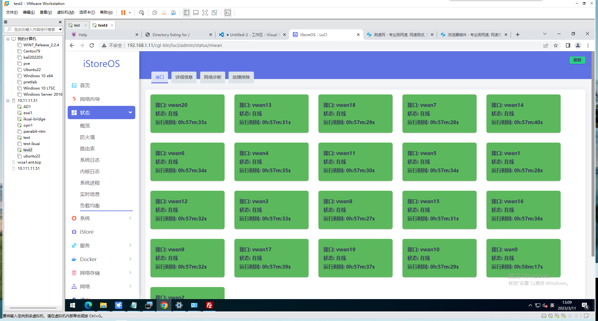
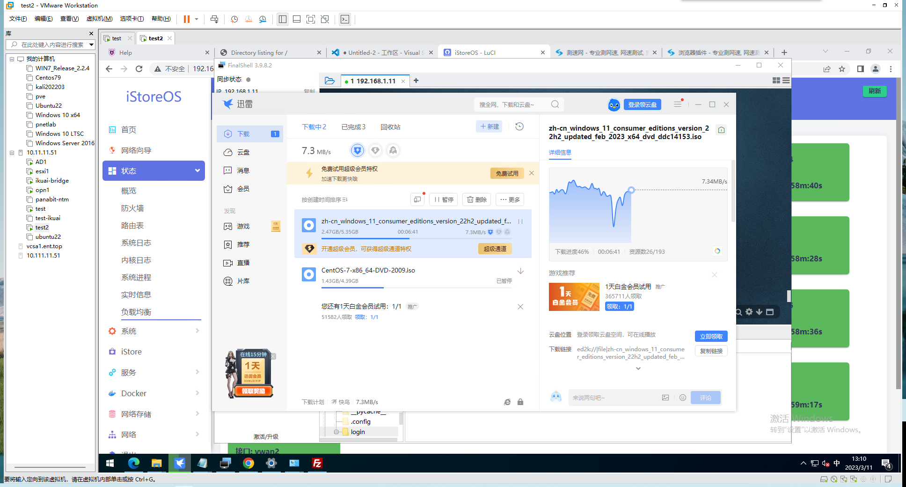
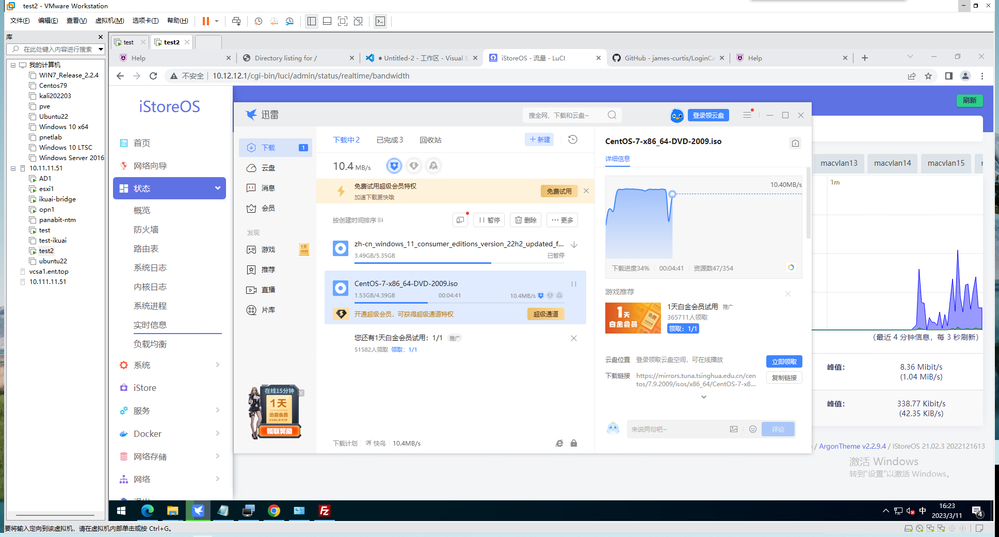
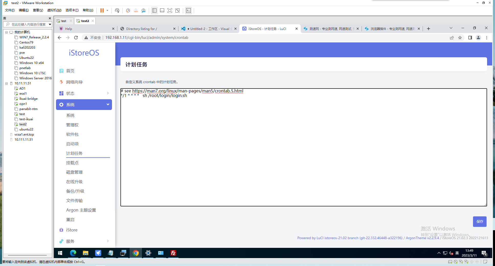

# 某学校图书馆网络登录的python3脚本

## 安装依赖

先接入路由器，用其他机器登录校园网（或者直接在shell中使用curl登录）

### 1. istoreOS shell中执行
```bash
opkg update
opkg install python3 python3-pip python3-dev gcc 
```

### 2. 在面板的iStore商店中安装 `多线多播` (搜索mwan也行)

## 单线单拨使用方法： 

### 1. 登录校园网

获取帮助 `python main.py -h`

### 2. 检查登录情况

获取帮助 `python test.py -h`

如果所有接口都成功登录校园网，那么返回结果应该都是公网ip，否则会出现html代码和`1.1.1.1`等字样

## 多线多拨使用方法

### 0. 上传文件安装依赖

进入shell

创建文件夹 
```shell
mkdir /root/login
```

上传项目文件到 `/root/login`

安装依赖
```shell
cd /root/login
pip config set global.index-url https://pypi.tuna.tsinghua.edu.cn/simple
pip install -r requirements.txt
```

### 1. 重新配置负载均衡

进入 网络》负载均衡

删除 接口、成员 下面的所有东西

在策略tab下，删除除了 `balanced` 之外的所有条目

### 2. 配置多线多拨

进入 网络》多线多拨 **参考**下图配置后保存应用


检测一下macvlan是否生效，进入 网络》接口》设备，重点检查macvlan开头的设备有没有mac

> 如果没有mac的话重新执行上面步骤，多试几次。或者重启一下
> 
> 一定**不要**勾选 `绑定物理接口` 



链接shell

找到文件 `/etc/config/network`

在vscdoe里面应用下面两条替换或者使用命令替换

> 命令：
> 
> `sed -i "s/option proto 'pppoe'/option proto 'dhcp'/g" /etc/config/network`
> 
> `sed -i "s/option username/option metric/g" /etc/config/network`
> 
> vscode替换：
> 
> 搜索 `option proto 'pppoe'`
> 
> 替换 `option proto 'dhcp'`
> 
>
> 搜索 `option username`
> 
> 替换 `option metric`

替换前如下图


替换后如下图


完成后，上传覆盖原文件

回到 网络》接口，随便找个macvlan开头的接口，点击右侧的重启按钮

等待所有macvlan开头的接口都获取到ip之后执行下一步

这里需要记录一下获取到的ip前缀，比如我这里都是 `10.0.41.xxx` 那么通用的前缀就是 `10.0.41.`


### 3. 开始多拨

使用 `main.py` 批量登录校园网

使用方法
```shell
root@iStoreOS:~/login# python main.py -h
usage: main.py [-h] [-u USER] [-m PWD] [-i INTERFACE] [-p PREFIX]

options:
  -h, --help            show this help message and exit
  -u USER, --user USER  校园网账号名
  -m PWD, --pwd PWD     校园网账号密码
  -i INTERFACE, --interface INTERFACE
                        指定接口的ip地址
  -p PREFIX, --prefix PREFIX
                        前缀
```

这里需要用到 `-p` 这个参数即可，值 填写上面记录的 `10.0.41.`

执行命令进行多拨
```shell
python main.py -p 10.0.41.
```

看到出现 `success` 那么就是该接口登录成功了。但是不一定所有接口都是success

所以要多执行几次，直到所有接口返回的结果都是 `mac error` 那么就是全部登录完成

> Q: 为什么 `mac error` 是登录成功？
> 
> A: 咱这里的校园网就是这样的，第一次登录可以获取到mac，
> 
> 如果已经登录过了，那么就不会返回mac，并且会跳转到其他页面，所以也就出现了 `mac error`
> 
> <<<<<<提示>>>>>>
> 使用 `python test -p 10.0.41.` 可以在不登录的情况下测试接口连通性，返回结果是公网ip



###  4. 配置负载均衡接口

进入面板，找到 网络》负载均衡》策略

检查成员和策略是否都自动添加上了


进入 状态》负载均衡，检查一下在线接口


### 5. enjoy!

用迅雷下载个东西试试



### 6. 计划任务

校园网长时间没有流量就会自动断开，所以这里配置一下计划任务，每一分钟都自动登录一次

上传 `login.sh` 到 `/root/login/login.sh`，更改权限

```shell
chmod 755 /root/login/*
```

在 系统》计划任务 添加如下命令

> `login.sh` 中的登录命令需要修改为你自己的

```shell
*/1 * * * *    sh /root/login/login.sh
```



验证是否生效

查看一下 `/tmp/login.log` ，如果文件有内容就说明生效了
